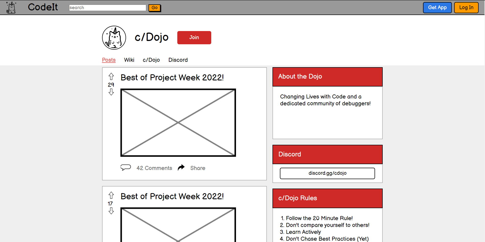

<h2 align="center"> Projects I've made during my time at Coding Dojo:<h2>

 <!--calculator-->

<h5 align="center">Styled after the Casio MS-80B, this is a working 4 function, draggable calculator. Try it out on the website!</h5>

<h5><a href="https://evanwiorek.github.io/JavaScript-Calculator/">Website</a>&nbsp;|&nbsp;<a href="https://github.com/EvanWiorek/JavaScript-Calculator">Repo</a></h5>

&nbsp;

   <!--starry clock-->

<h5 align="center">This clock is made using JavaScript, HTML, and CSS. Displays in both analog and digital.</h5>

<h5><a href="https://evanwiorek.github.io/Starry-Clock/">Website</a>&nbsp;|&nbsp;<a href="https://github.com/EvanWiorek/Starry-Clock">Repo</a></h5>

&nbsp;

&nbsp;

<h5 align="center"><a href="https://github.com/EvanWiorek/Bootcamp-Projects/tree/main/Projects/css-html/piet-mondrian">Piet Mondrian</a></h5>

&nbsp;

&nbsp;

<h5 align="center"><a href="https://github.com/EvanWiorek/Bootcamp-Projects/tree/main/Projects/html-css-js/code-it">Code-It</a></h5>

